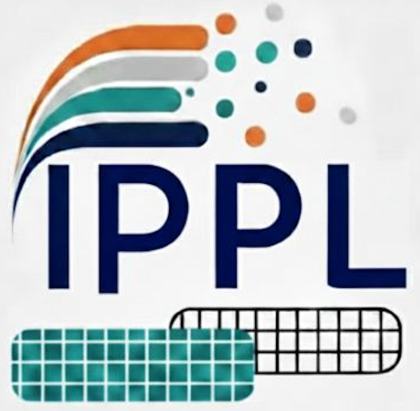

<p align="center">
  <br>
</p>
<p align="right">
  <sub><sub><sup><sup><em> 
  IPPL-logo; design by S.A.T.Klapproth</em> </sup></sup></sup></sub>
</p>

<p align="center">
  <a href="https://ippl-bc4558.pages.jsc.fz-juelich.de/">
    
  </a>
  <a href="https://my.cdash.org/index.php?project=IPPL">
    
  </a>
  <a href="https://en.wikipedia.org/wiki/C%2B%2B20">
    
  </a>
  <a href="https://doi.org/10.5281/zenodo.8389192">
    
  </a>
  <a href="https://github.com/IPPL-framework/ippl/blob/master/LICENSE">
    
  </a>
</p>

The IPPL (Independent Parallel Particle Layer) library
provides performance portable and dimension independent
building blocks for scientific simulations requiring particle-mesh
methods, with Eulerian (mesh-based) and Lagrangian (particle-based) approaches.
IPPL makes use of [Kokkos](https://github.com/kokkos/kokkos), [HeFFTe](https://github.com/icl-utk-edu/heffte), and MPI (Message Passing Interface) to deliver a portable,
massively parallel toolkit for particle-mesh methods. IPPL supports simulations in one to six dimensions, mixed precision, and asynchronous execution in different execution spaces (e.g. CPUs and GPUs).

**[Resources](#Resources)** |
**[Contributions](#contributions)** |
**[CI/CD](#cicd-and-pr-testing)** |
**[Citing IPPL](#citing-ippl)** |

# Resources

The [IPPL Manual](https://ippl-framework.github.io/Manual/) contains comprehensive documentation, including:
- **Installation Instructions:** Guides for building locally and on various HPC systems.
- **Framework Overview:** A broad look at IPPL's core functionalities.
- **Theory & Examples:** Underlying theoretical concepts alongside practical code examples.

For detailed API, class, and file documentation, please visit our [Doxygen site](https://ippl-framework.github.io/ippl/).

**Feedback & Support**
If you find any issues with the manual, please report them in the [Manual's GitHub repository](https://github.com/IPPL-framework/Manual).


# Contributions
We are open and welcome contributions from others. Please open an issue and a corresponding pull request in the main repository if it is a bug fix or a minor change.

For larger projects we recommend to fork the main repository and then submit a pull request from it. More information regarding github workflow for forks can be found in this [page](https://docs.github.com/en/pull-requests/collaborating-with-pull-requests/working-with-forks) and how to submit a pull request from a fork can be found [here](https://docs.github.com/en/pull-requests/collaborating-with-pull-requests/proposing-changes-to-your-work-with-pull-requests/creating-a-pull-request-from-a-fork). Please follow the coding guidelines as mentioned in this [page](https://github.com/IPPL-framework/ippl/blob/master/WORKFLOW.md).

You can add an upstream to be able to get all the latest changes from the master. For example, if you are working with a fork of the main repository, you can add the upstream by:
```bash
$ git remote add upstream git@github.com:IPPL-framework/ippl.git
```
You can then easily pull by typing
```bash
$ git pull upstream master
```

Please refer to the [IPPL Manual](https://ippl-framework.github.io/Manual/) for further details regarding contributions, fromatting, unit tests, etc.
# CI/CD and PR testing
Please see [Julich CI results](https://ippl-bc4558.pages.jsc.fz-juelich.de/) and [CSCS PR testing](ci/cscs/cscs-ci-cd.md) for further information.

# Citing IPPL

```
@inproceedings{muralikrishnan2024scaling,
  title={Scaling and performance portability of the particle-in-cell scheme for plasma physics applications
         through mini-apps targeting exascale architectures},
  author={Muralikrishnan, Sriramkrishnan and Frey, Matthias and Vinciguerra, Alessandro and Ligotino, Michael
          and Cerfon, Antoine J and Stoyanov, Miroslav and Gayatri, Rahulkumar and Adelmann, Andreas},
  booktitle={Proceedings of the 2024 SIAM Conference on Parallel Processing for Scientific Computing (PP)},
  pages={26--38},
  year={2024},
  organization={SIAM}
}
```
