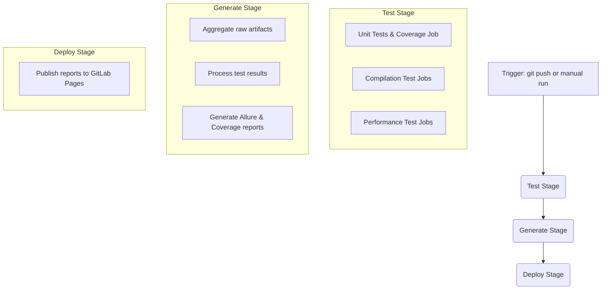
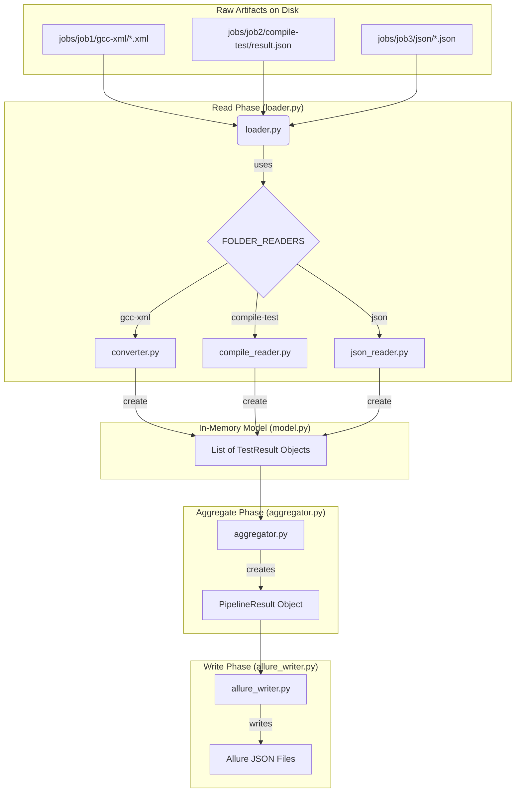

## Overview & Scope

This document describes the continuous integration (CI/CT) system for IPPL. Its purpose is to provide a robust, automated, and flexible framework for verifying the **correctness**, **stability**, and **performance** of the IPPL library across a wide range of environments.

As a **performance-portable framework**, IPPL is designed to run on diverse hardware, from developer laptops to large clusters, using different compilers (e.g., GCC, Clang) and parallel backends. This portability creates a significant testing challenge. We must ensure that the code not only compiles but also produces correct results across this set of configurations.

Therefore, the scope of this testing system is to:
* Automate a wide variety of test scenarios, including **compilation-only tests**, **unit tests**, and larger **integration tests**.
* Handle a rich set of test artifacts beyond simple pass/fail results. The system is built to capture and present diverse outputs, including **performance logs**, **rendered images**, **plots**, and raw simulation data.
* Provide a **centralized reporting dashboard** (via GitLab Pages, Allure, and code coverage reports) that aggregates these diverse results into a single, unified view for every pipeline run.
* Offer a **flexible interface** for developers to easily run specific test suites on demand from the GitLab UI.


## System Architecture

This section outlines the high-level architecture of the CI/CT system and justifies the core design principles behind it.

#### Pipeline Flow

The system uses a multi-stage GitLab CI pipeline to ensure a clear separation of concerns and execution in different environments. A typical pipeline proceeds through the following stages:


#### Architecture Notes
* **Test Selection** The choice which tests to run is made by setting a set of **CI/CD variables**. This way, the pipeline can also be started from the GitLab UI.
* **Decoupled Reporting** The testing stages are only responsible for generating the raw data, a dedicated generation stage is responsible for collecting this data and generating the report. This ensures easy extension to more distributed architectures and testing across various clusters each with their own access policies and infrastructure.
* **Storage** Currently, test results are stored on a separate GitLab branch, this might be moved to a dedicated data base in the future.


#### Processing of Test Results

* **Modular Report Generation**: The system uses a `Read -> Aggregate -> Write` architecture, orchestrated by a central Python CLI (`cli.py`). A pluggable loader system (`loader.py`) uses dedicated reader modules (`converter.py`, `compile_reader.py`, etc.) to parse various raw test formats into a standardized in-memory data model (`model.py`). This data is then grouped into suites (`aggregator.py`) and finally written out as an Allure report (`allure_writer.py`).

A detailed description can be found in the **Report Generation Architecture** section.


### Test Result Artifacts & Processing
For the reporting system to automatically discover and parse test results, each test job must place its output artifacts into a specific directory structure. This structure allows the `generate` stage to identify which parser to use for each result type.

#### Output Directory Structure

Every test job inherits a base output path from the `.test_template` defined in `tests.yml`. The full, required path for any artifact is `$CI_PIPELINE_ID$/jobs/$CI_JOB_ID/`.

* **`results/${CI_PIPELINE_ID}/jobs/${CI_JOB_ID}/`**: This base path is automatically created and ensures that results from each job in a pipeline are stored in a unique location.

* **`<custom_folder_name>/`**: This is the most critical part. Inside its unique job directory, a test must create a subdirectory whose name corresponds to a known parser format. For example, a CTest job must place its XML output in a `gcc-xml` folder.

#### How the `generate` Stage Handles Results

The `generate_report` job orchestrates the processing of these artifacts. The logic is handled by a set of Python scripts with a pluggable architecture:

1.  The main `loader.py` script scans the `results/${CI_PIPELINE_ID}/jobs/` directory for all individual job outputs.
2.  For each job, it looks at the names of the custom subdirectories (e.g., `gcc-xml`, `compile-test`).
3.  It then uses the subdirectory name as a key to look up the correct parsing function in the `FOLDER_READERS` dictionary defined in `loader.py`.
4.  The corresponding parser (e.g., `read_gcc_xml_folder` from `converter.py`) is then called to process the files within that directory, converting them into a standard in-memory format.

This structure makes the system easily extensible. To support a new test output format, one only needs to write a new parser function and register it in the `FOLDER_READERS` dictionary.


## How to Add a New Test

There are two primary ways to add a test to the CI system, depending on whether its output format is already supported.

---
#### Scenario A: Adding a Test with an Existing Format
This is the most common scenario. Use this method if your new test job produces results in a format that the system already understands (e.g., CTest XML or the simple `result.json`).

**Step 1: Create the Test Job YAML**
Create a new `.yml` file in the `ci/tests/` directory (e.g., `ci/tests/my_new_compile_test.yml`). The script in this file must generate its raw artifact files in a subdirectory whose name matches an existing reader key in `loader.py`. It is important to extend the `.test_template` and use the variables it provides (for example `$RESULTS_DIR`) to be flexible in case of changes in the future.

* For compilation-style tests, use the `compile-test` folder and have your test create a `result.json`.
* For CTest-style results, use the `gcc-xml` folder and have your test create one or more `.xml` files.

*Example `ci/tests/my_new_compile_test.yml`:*
```yaml
my-new-compile-test:
  extends: .test_template
  stage: test
  script:
    # This script runs a build and checks its status.
    # Crucially, it creates its output in the 'compile-test' subdirectory.
    - mkdir -p "${RESULTS_DIR}/compile-test"
    - |
      # ... script logic to determine PASS/FAIL status ...
      echo '{ "name": "My New Compile Test", "status": "passed" }' > "${RESULTS_DIR}/compile-test/result.json"
```

**Step 2: Define a Control Variable**
Open `tests.yml` and add a new variable to the `variables:` block to provide an interface when your test should run.

```yaml
# In tests.yml
variables:
  # ... existing variables ...
  RUN_MY_NEW_COMPILE_TEST:
    value: "true"
    options: ["true", "false"]
    description: "Run my new custom compilation test."
```

**Step 3: Add a Rule to your Job**
In your new `my_new_compile_test.yml` file, add a `rules` block that checks for your new variable.

```yaml
my-new-compile-test:
  extends: .test_template
  # ...
  rules:
    - if: '$RUN_MY_NEW_COMPILE_TEST == "true" || $RUN_ALL_TESTS == "true"'
```
**Step 4: Include the test in the Main CI File**
Finally, add your new file to the `include:` list in `tests.yml`.

```yaml
# In tests.yml
include:
  - local: 'ci/tests/serial_unit.yml'
  # ... other includes ...
  - local: 'ci/tests/my_new_compile_test.yml' # Add your new file
```

#### Scenario B: Adding a New Test Type (and a New Loader)

Use this method if your test produces a completely new data format that the system doesn't know how to parse.
This might be useful if you want to run a simulation and use a custom Python script to generate a plot or have a new data-format.

**Step 1: Create the Test Job YAML**
Follow Step 1 from Scenario A, but have your script create its artifacts in a subdirectory with a new, unique name (e.g., `my-custom-format`).

**Step 2: Create a New Python Reader Function**
In the `ci/test_results_processor/` directory, create a new file (e.g., `my_reader.py`). Inside this file, write a function that takes the folder path as input and returns a list of `TestResult` objects that conform to the data model. You can be inspired by other readers such as the `json_reader.py` file.

*Example `ci/test_results_processor/my_reader.py`:*
```py
from pathlib import Path
from typing import List
from .model import TestResult, Label # Import the data model
from uuid import uuid4
import hashlib

def read_my_custom_format(folder: Path, test_run_id: str) -> List[TestResult]:
    # --- Your custom parsing logic here ---
    # 1. Find and read your custom file (e.g., my_output.txt).
    # 2. Parse the contents.
    # 3. Create and return a list of TestResult objects.
    
    # Dummy example:
    my_test = TestResult(
        name="My Custom Test Result",
        status="passed",
        uuid=str(uuid4()),
        testRunId=test_run_id,
        historyId=hashlib.sha1("My Custom Test Result".encode()).hexdigest(),
        labels=[Label(name="suite", value="Custom Suite")]
    )
    return [my_test]
```

**Step 3: Register Your New Reader**
Open `ci/test_results_processor/loader.py` and register your new reader function in the `FOLDER_READERS` dictionary. This makes the system aware of your new format.


*Example `ci/test_results_processor/loader.py`:*
```py
# ... other imports ...
from .my_reader import read_my_custom_format # 1. Import your new function

FOLDER_READERS = {
    "gcc-xml": read_gcc_xml_folder,
    "json": read_json_folder,
    "compile-test": read_compile_test,
    "my-custom-format": read_my_custom_format # 2. Add your new entry
}
# ...
```

**Step 4: Add the Test to CI**
Follow Steps 2, 3, and 4 from Scenario A to create a control variable, add a rule to your job, and include the new test job's `.yml` file in the main `tests.yml`.


### Report Generation Architecture

The final reports are generated by a collection of Python scripts that follow a clear **Read -> Aggregate -> Write** architecture. These scripts are responsible for finding all raw test artifacts on disk, parsing them into a standardized in-memory format, and then writing them out as an Allure report.

#### Data Flow

The entire process is orchestrated by the main command-line interface (`cli.py`). The flow of data is as follows:


#### Component breakdown
The system is broken down into the following Python modules:
* `model.py` This is the data-model, it uses `pydantic` to define a type-checked memory model for the test data. It defines the objects `TestResult`, `TestSuite` and `PipelineResult`. This markdown file also provides a textual interpretation of those fields.
* `cli.py` This provides the command-line interface for the system. It orchestrates the entire process.
* `loader.py` This module is responsible for iterating through the raw test data and load them into our memory-model. It provides the interface `FOLDER_READERS` which maps specific folder names (like `gcc-xml` or `compile-test`) to their correct parsing functions.  
* **Readers** (`converter.py`, `compile-reader.py`, etc.). Each module is a specialized reader for a test-type, it interprets the ad-hoc output of that test type and turns them into the standardized `TestResult` objects defined in `model.py`.
* `aggregator.py`: This module takes the flat list of all `TestResult` objects generated by the readers and organizes them hierarchically, grouping them into suites. In the end, it provides a `PipelineResult` object.
* `allure_writer.py`: The final part of the process, it takes the `PipelineResult` object and turns it into the specific format used by the Allure framework. In principle, this system can be adapted to provide different kind of output by making a new writer and adding that to the `cli.py`


### `TestResult` Specification

This section defines the structure of a `TestResult` — the symbolic representation of a single test execution outcome in the IPPL testing infrastructure. This result object is used internally by the test runner and reporting infrastructure and is designed to be serialized (e.g., to JSON) and transformed into formats such as Allure result files.

The structure is designed to:
- Be flexible by having only a small number of required field.
- Support a rich set of features through optional arguments.

---

#### Required Fields

These fields must be present in all `TestResult` objects.

| Field        | Type    | Description |
|--------------|---------|-------------|
| `name`       | `string` | Unique short name for the specific test in a specific environment |
| `status`     | `string` | Outcome of the test: `"passed"`, `"failed"`, `"skipped"`, or `"broken"` |
| `uuid`       | `string (uuid)` | Unique identifier for this specific test execution. Must be different each time the test runs. |
| `testRunId`  | `string` | ID shared across all tests in a single run/session. Used to group results for a test batch that are shown together. |
| `historyId`  | `string` | Logical stable ID of the test, used to identify a test through different runs. |

---

#### Optional Timing Fields

| Field      | Type   | Description |
|------------|--------|-------------|
| `start`    | `int`  | UNIX timestamp in milliseconds for when the test started |
| `stop`     | `int`  | UNIX timestamp in milliseconds for when the test ended |
| `duration` | `int`  | Test duration in milliseconds (useful when `start`/`stop` are unknown) |

---

#### Optional Metadata (via `labels`)

All categorical or grouping metadata is passed through the `labels` array, following [Allure](https://allurereport.org/docs/how-it-works-test-result-file/) conventions.

| Field    | Type           | Description                                                 |
| -------- | -------------- | ----------------------------------------------------------- |
| `labels` | `list<object>` | Arbitrary metadata as `{ "name": <key>, "value": <value> }` |

---

#### Other Optional Fields

| Field           | Type           | Description                                                 |
| --------------- | -------------- | ----------------------------------------------------------- |
| `parameters`    | `list<object>` | Input parameters (e.g., `"grid_size": "128x128x128"`)       |
| `steps`         | `list<object>` | Structured breakdown of test phases, with timing and status |
| `attachments`   | `list<object>` | Files related to the test (logs, images, raw output)        |
| `statusDetails` | `object`       | Contains `message` and `trace` for diagnostics              |
| `executor`      | `object`       | CI metadata (runner name, build URL, etc.)                  |
