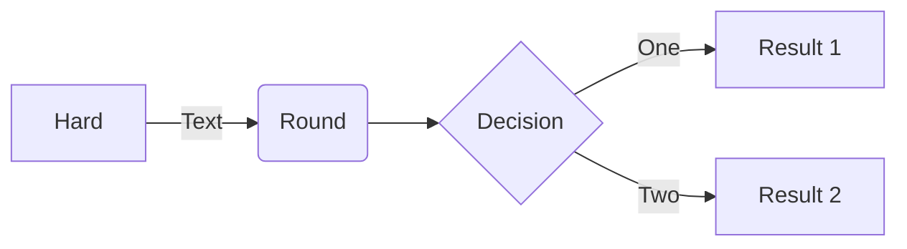

# UML-markdown


### Integrate PlantUML render engine with GitHub markdown

This part is simple, yet effective :) Simply use the PlantUML proxy `http://www.plantuml.com/plantuml/proxy` to render your `*.iuml` files and embed them like images:

```

``` 

Use the `RAW` version of your `*.iuml` files like that: [https://raw.githubusercontent.com/klappi-s/ippl-frk/tree/insitu-vis-steer/doc/diagrams/classDiagrams/alpine.puml](https://raw.githubusercontent.com/klappi-s/ippl-frk/insitu-vis-steer/doc/diagrams/classDiagrams/alpine.puml) and prefix it with `src=`.

Also you should use the `cache=no` option so that GitHub always renders the currently committed version of your PlantUML `*.iuml` files.

That's all - simply see the diagram live.


## UML for IPPL

### Class Diagrams

Alpine:


IPPL core


### Sequence Diagrams

Complete:


Simple:


## Mermaid
Example for mermaid ...

